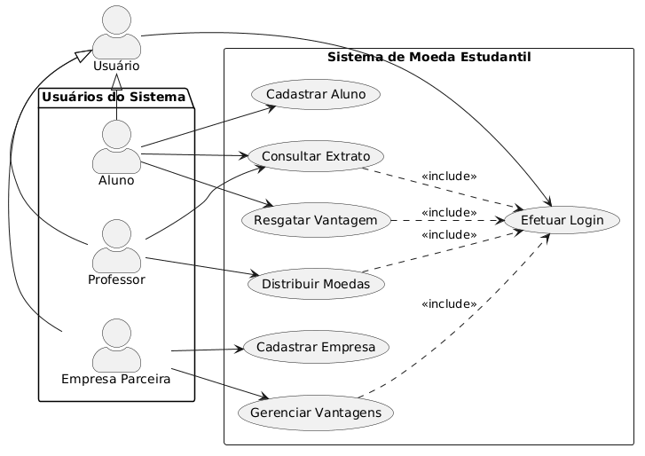

# 🏷️ Sistema de moeda estudantil

Sistema web desenvolvido para gerenciar o moeda virtual, com o intuido de estimular o reconhecimento do mérito estudantil.
O projeto está sendo desenvolvido como parte da disciplina **Laboratório de Desenvolvimento de Software**.

---

## 🚧 Status do Projeto


[](https://github.com/Mateus7799/Lab-02-Sistema-de-Aluguel-de-Carros.git)

---

## 📚 Índice
- [Sobre o Projeto](#sobre-o-projeto)
- [Diagramas](#-diagramas)
- [Funcionalidades](#-funcionalidades-principais)
- [Autores](#-autores)
- [Tecnologias Utilizadas](#-tecnologias-utilizadas)


---
## 📝 Sobre o Projeto

Este projeto consiste no desenvolvimento de um sistema web para gerenciamento de ummoeda virtual, com o intuido de estimular o reconhecimento do mérito estudantil.
O sistema foi projetado com foco em organização, modularidade e clareza estrutural, utilizando conceitos de engenharia de software como modelagem UML, separação de responsabilidades e planejamento orientado a boas práticas de desenvolvimento.

Este projeto está sendo desenvolvido como parte da disciplina **Laboratório de Desenvolvimento de Software**, com o objetivo de aplicar na prática os conceitos estudados ao longo do curso.

**Principais características:**

- 
- 
- 
- 

---

## 📷 Diagramas

### Diagrama de Casos de Uso



### Diagrama de Classes
 


### Diagrama de Coponentes


### Modelo ER


---

## ✨ Funcionalidades Principais

- 
- 
- 
- 

---

## 👨‍💻 Autores

- Arthur Modesto Couto
- Bernardo Carvalho Denucci Mercado
- Mateus Azevedo Araújo
- Matheus Dias Mendes
  

## 📁 Estrutura do Projeto

```


```


## 🚀 Como Executar

### Frontend


### Backend


## 🛠️ Tecnologias Utilizadas

* **Frontend:** 
* **Backend:** 
* **Banco de Dados:** 

---
