# 🏷️ Sistema de moeda estudantil

Sistema web desenvolvido para gerenciar o moeda virtual, com o intuito de estimular o reconhecimento do mérito estudantil.
O projeto está sendo desenvolvido como parte da disciplina **Laboratório de Desenvolvimento de Software**.

---

## 🚧 Status do Projeto

<div align="center">


[](https://github.com/Mateus7799/Lab-Dev-sistema-moeda-estudantil.git)

</div>

<div align="center">


</div>


---

## 📚 Índice
- [Sobre o Projeto](#sobre-o-projeto)
- [Principais Características](#principais-características)
- [Diagramas](#diagramas)
- [Casos de Uso](#casos-de-uso)
- [Funcionalidades Principais](#funcionalidades-principais)
- [Autores](#autores)
- [Estrutura do Projeto](#estrutura-do-projeto)
- [Como Executar](#-como-executar)
- [Tecnologias Utilizadas](#-tecnologias-utilizadas)


---
## 📝 Sobre o Projeto

Este projeto consiste no desenvolvimento de um sistema web para gerenciamento de uma moeda virtual, com o intuido de estimular o reconhecimento do mérito estudantil.
O sistema foi projetado com foco em organização, modularidade e clareza estrutural, utilizando conceitos de engenharia de software como modelagem UML, separação de responsabilidades e planejamento orientado a boas práticas de desenvolvimento.

Este projeto está sendo desenvolvido como parte da disciplina **Laboratório de Desenvolvimento de Software**, com o objetivo de aplicar na prática os conceitos estudados ao longo do curso.


## 📌 Principais características

- **Arquitetura Full Stack:** Frontend robusto em React e backend escalável com Spring Boot.
- **Comunicação Segura:** Integração via API REST utilizando Axios e configurações de segurança de CORS.
- **Persistência Confiável:** Modelagem e mapeamento relacional robusto utilizando Spring Data JPA e banco de dados PostgreSQL.
- **Processamento Assíncrono:** Arquitetura orientada a eventos utilizando RabbitMQ para garantir resgates de vantagens sem travamento da UI e com alta consistência.
- **Ambiente Isolado:** Containerização completa da aplicação e banco de dados via Docker e Docker Compose, facilitando o deploy e execução.

---

## 📷 Diagramas

### Diagrama de Casos de Uso
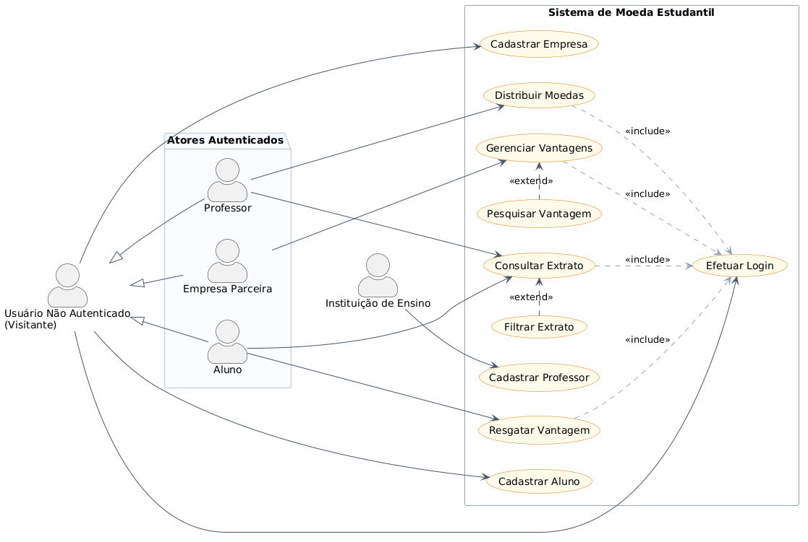


### Diagrama de Classes
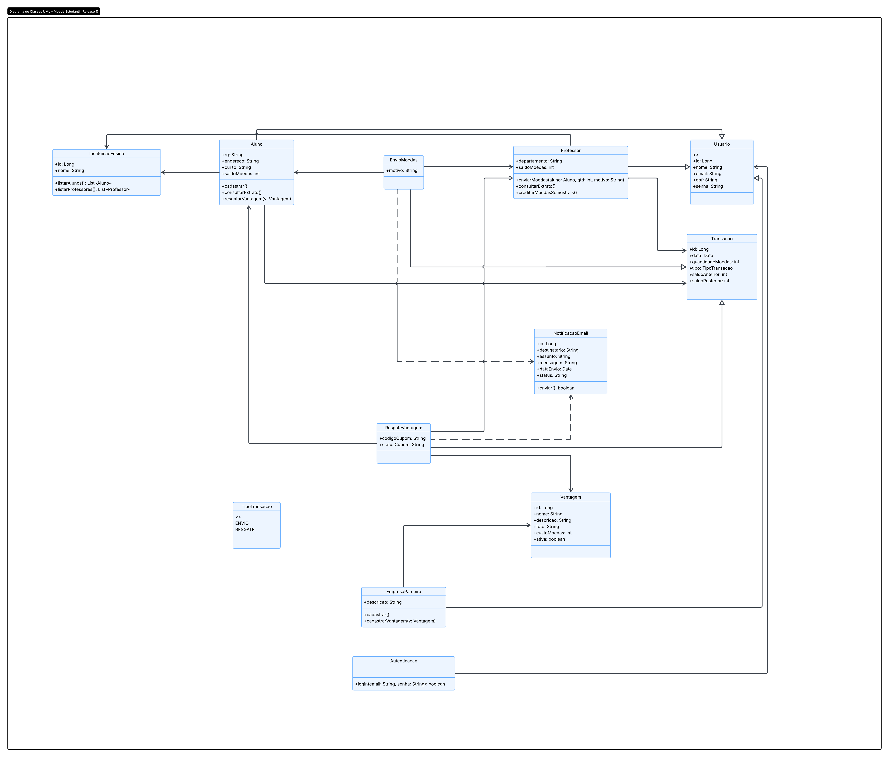 


### Diagrama de Componentes
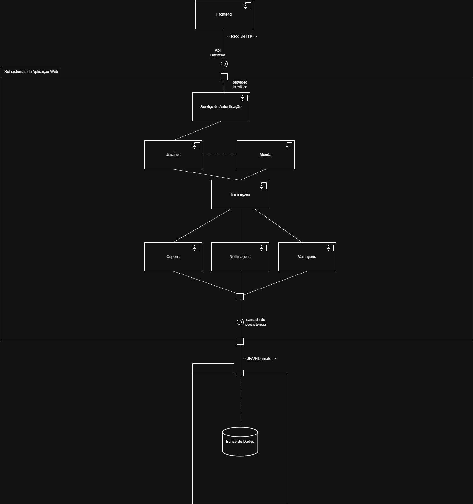


### Modelo ER
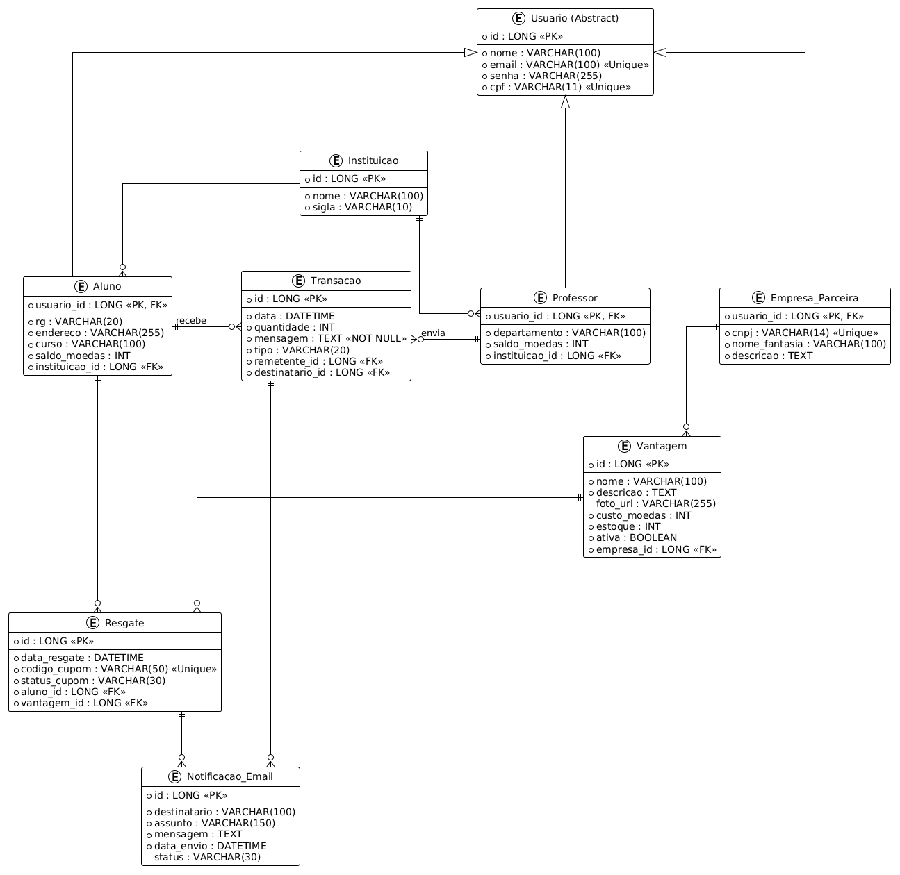


---


## 🎬 Casos de Uso (Diagramas de Sequência)

### UC01 - Cadastrar Aluno
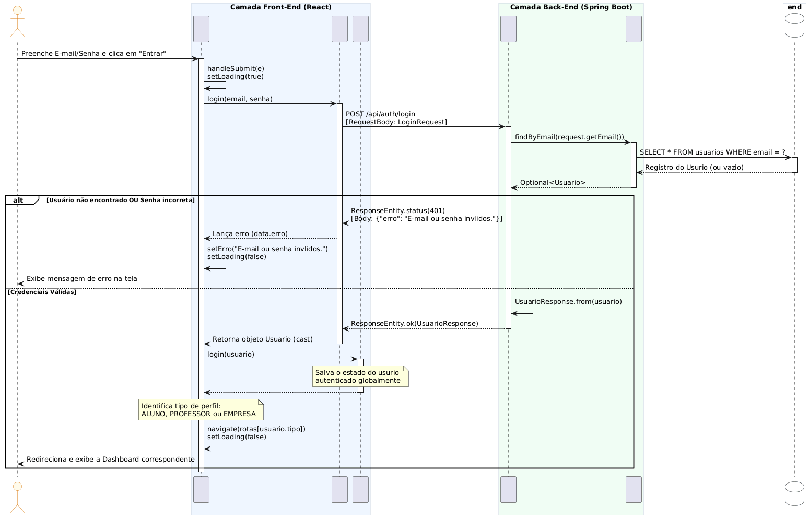

### UC02 - Cadastrar Empresa Parceira
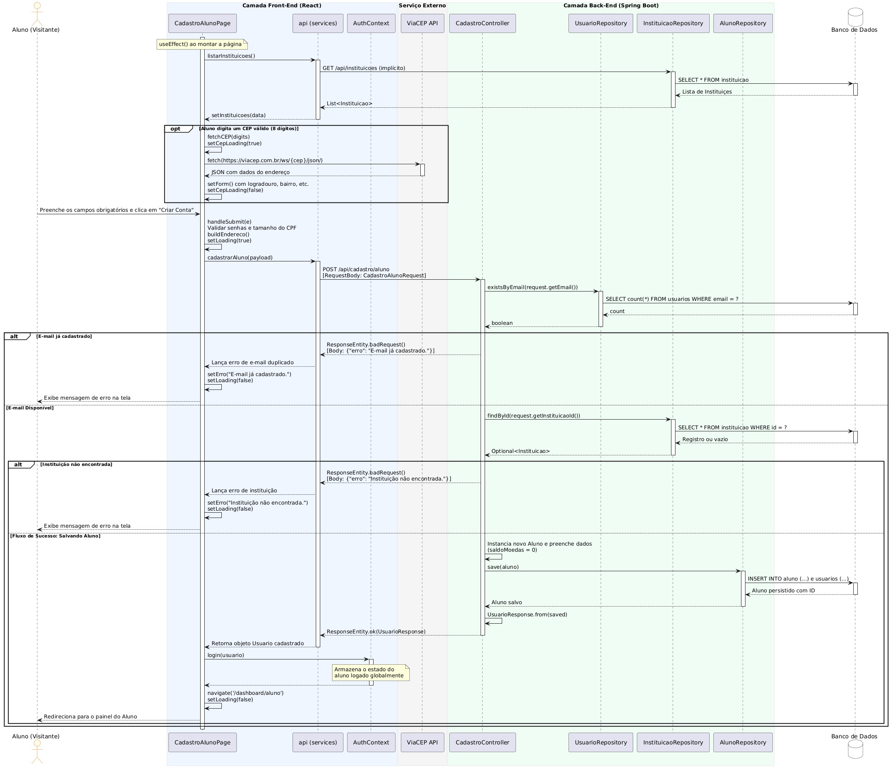

### UC03 - Login / Autenticação
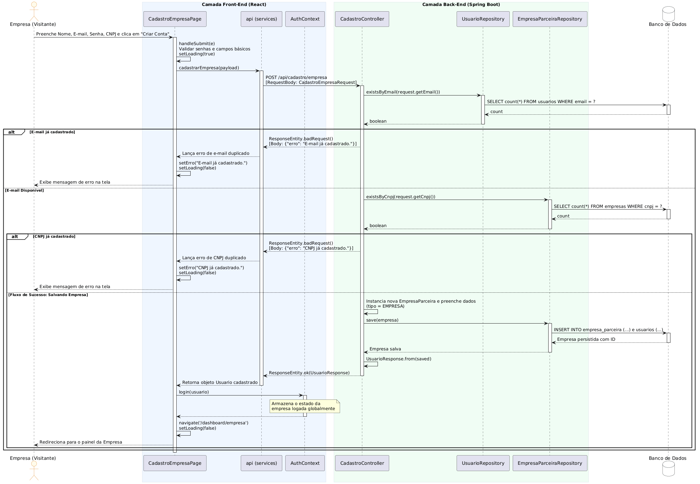

### UC04 - Consultar Extrato (Aluno)
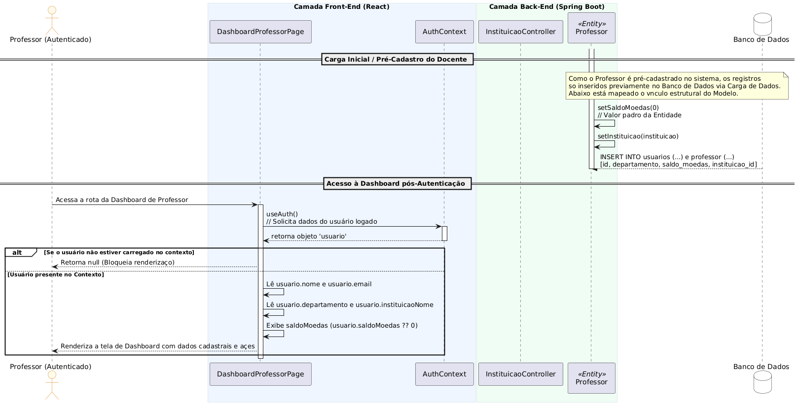

### UC05 - Enviar Moedas (Professor para Aluno)
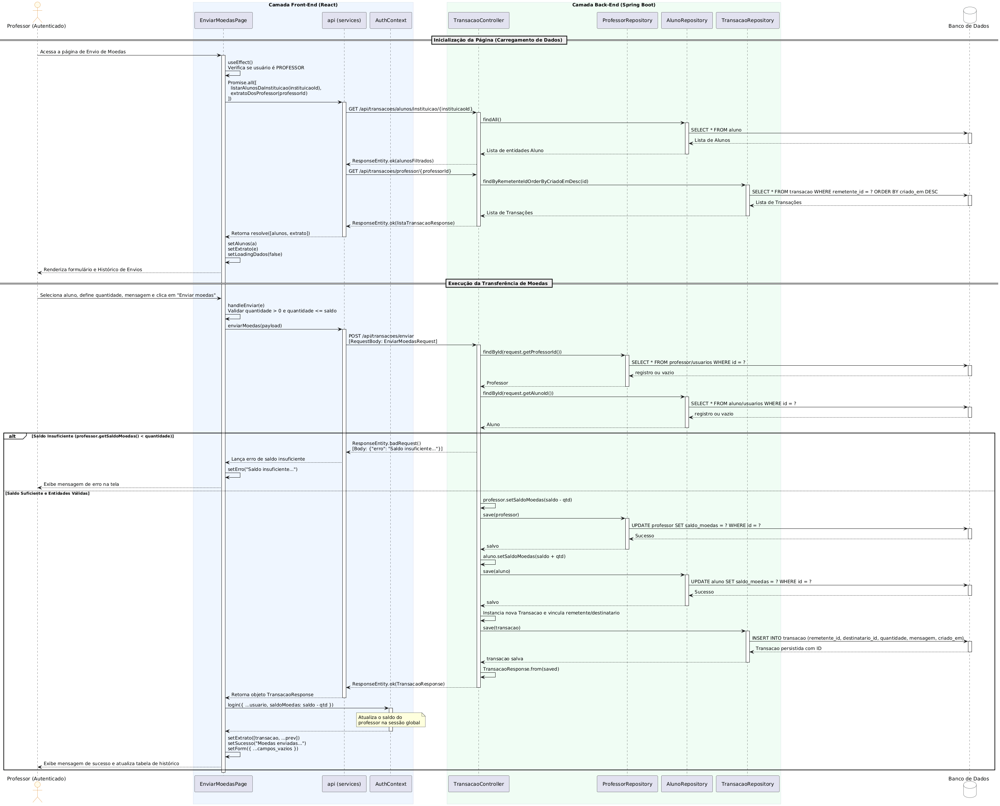

### UC06 - Cadastrar Vantagem (Empresa)
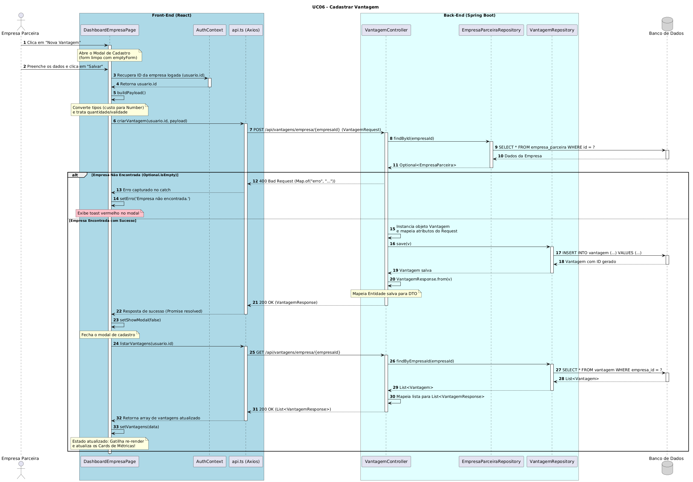

### UC07 - Visualizar Vantagens e Cupons Resgatados (Aluno)
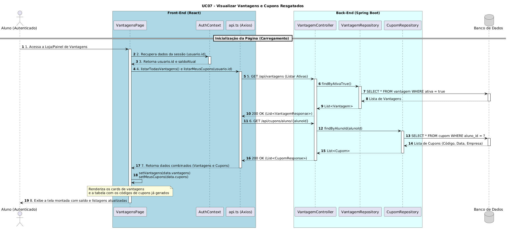

### UC08 - Resgatar Vantagem (Processamento Assíncrono)
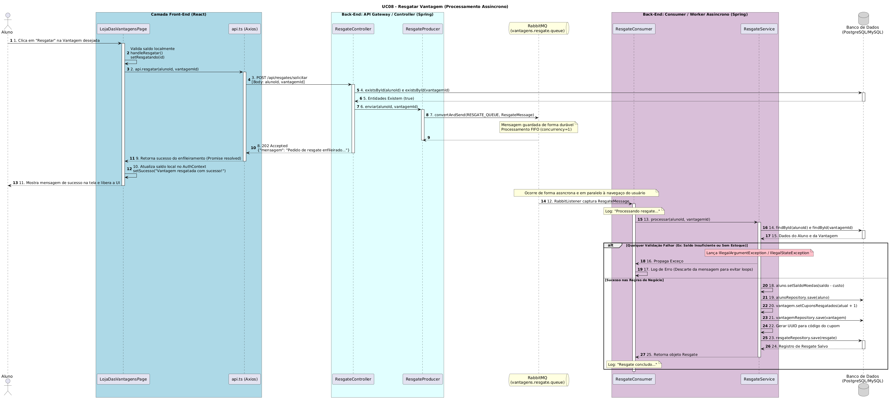


---

## ✨ Funcionalidades Principais

- Cadastro e autenticação de usuários
- Gerenciamento de alunos, instituições e empresas parceiras
- Controle de vantagens e benefícios disponíveis
- Dashboard com informações e funcionalidades específicas por perfil de usuário

---

## 👨‍💻 Autores

- Arthur Modesto Couto
- Bernardo Carvalho Denucci Mercado
- Mateus Azevedo Araújo
- Matheus Dias Mendes
  

## 📁 Estrutura do Projeto

```
Lab-Dev-sistema-moeda-estudantil/
│
├── Codigo/
│   │
│   ├── backend/
│   │   ├── pom.xml
│   │   ├── .gitignore
│   │   ├── data/
│   │   │   └── moeda_db.mv.db
│   │   │
│   │   ├── src/main/
│   │   │   ├── java/
│   │   │   │   └── com/sistemamoedaestudantil/
│   │   │   │       ├── config/
│   │   │   │       │   └── CorsConfig.java
│   │   │   │       │
│   │   │   │       ├── controller/
│   │   │   │       │   ├── AuthController.java
│   │   │   │       │   ├── CadastroController.java
│   │   │   │       │   ├── InstituicaoController.java
│   │   │   │       │   └── VantagemController.java
│   │   │   │       │
│   │   │   │       ├── dto/
│   │   │   │       │   ├── request/
│   │   │   │       │   │   ├── CadastroAlunoRequest.java
│   │   │   │       │   │   ├── CadastroEmpresaRequest.java
│   │   │   │       │   │   ├── LoginRequest.java
│   │   │   │       │   │   └── VantagemRequest.java
│   │   │   │       │   │
│   │   │   │       │   └── response/
│   │   │   │       │       ├── UsuarioResponse.java
│   │   │   │       │       └── VantagemResponse.java
│   │   │   │       │
│   │   │   │       ├── model/
│   │   │   │       │   ├── Aluno.java
│   │   │   │       │   ├── EmpresaParceira.java
│   │   │   │       │   ├── Instituicao.java
│   │   │   │       │   └── Vantagem.java
│   │   │   │       │
│   │   │   │       ├── repository/
│   │   │   │       │   ├── AlunoRepository.java
│   │   │   │       │   ├── EmpresaRepository.java
│   │   │   │       │   ├── InstituicaoRepository.java
│   │   │   │       │   └── VantagemRepository.java
│   │   │   │       │
│   │   │   │       ├── service/
│   │   │   │       │   ├── AuthService.java
│   │   │   │       │   ├── CadastroService.java
│   │   │   │       │   ├── InstituicaoService.java
│   │   │   │       │   └── VantagemService.java
│   │   │   │       │
│   │   │   │       └── SistemaMoedaEstudantilApplication.java
│   │   │   │
│   │   │   └── resources/
│   │   │       ├── application.properties
│   │   │       └── static/
│   │   │
│   │   └── target/                        
│   │
│   └── frontend/
│       ├── package.json
│       ├── package-lock.json
│       ├── vite.config.ts
│       ├── tailwind.config.js
│       ├── tsconfig.json
│       ├── eslint.config.js
│       ├── postcss.config.js
│       ├── index.html
│       ├── .gitignore
│       │
│       ├── src/
│       │   ├── main.tsx                     (entry point React)
│       │   ├── App.tsx                      (rotas principais)
│       │   ├── App.css
│       │   ├── index.css
│       │   │
│       │   ├── assets/
│       │   │
│       │   ├── components/
│       │   │   ├── Navbar.tsx
│       │   │   ├── Sidebar.tsx
│       │   │   ├── CardDashboard.tsx
│       │   │   └── FormularioCadastro.tsx
│       │   │
│       │   ├── context/
│       │   │   └── AuthContext.tsx
│       │   │
│       │   ├── services/
│       │   │   ├── api.ts
│       │   │   ├── authService.ts
│       │   │   ├── alunoService.ts
│       │   │   ├── instituicaoService.ts
│       │   │   └── vantagemService.ts
│       │   │
│       │   ├── types/
│       │   │   └── index.ts
│       │   │
│       │   └── pages/
│       │       ├── LoginPage.tsx
│       │       ├── CadastroAlunoPage.tsx
│       │       ├── DashboardProfessorPage.tsx
│       │       └── DashboardEmpresaPage.tsx
│       │
│       └── dist/                            (build - ignorado)
│
├── docker-compose.yml
├── COMO_EXECUTAR.md
└── README.md


```

# 🚀 Como Executar

## Frontend

1. Acesse a pasta do frontend:

```bash
cd Codigo/frontend
```

2. Instale as dependências:

```bash
npm install
```

3. Execute o projeto:

```bash
npm run dev
```

4. O frontend estará disponível em:

```txt
http://localhost:5173
```

---

## Backend

1. Acesse a pasta do backend:

```bash
cd Codigo/backend
```

2. Execute o projeto Spring Boot:

### Linux/Mac

```bash
./mvnw spring-boot:run
```

### Windows PowerShell

```powershell
mvnw spring-boot:run
```

Ou, caso tenha Maven instalado globalmente:

```bash
mvn spring-boot:run
```

3. O backend estará disponível em:

```txt
http://localhost:8080
```

---

## Docker

Na pasta Codigo execute:

```bash
docker-compose up --build
```

Para executar em segundo plano:

```bash
docker-compose up -d
```

Para encerrar os containers:

```bash
docker-compose down
```

---

# 🛠️ Tecnologias Utilizadas

## Frontend

- React
- TypeScript
- Vite
- Tailwind CSS
- React Router DOM
- Axios

## Backend

- Java 21
- Spring Boot
- Spring Web
- Spring Data JPA
- Maven
- Spring AMQP (RabbitMQ)

## Banco de Dados

- PostgreSQL

## DevOps

- Docker
- Docker Compose

---
